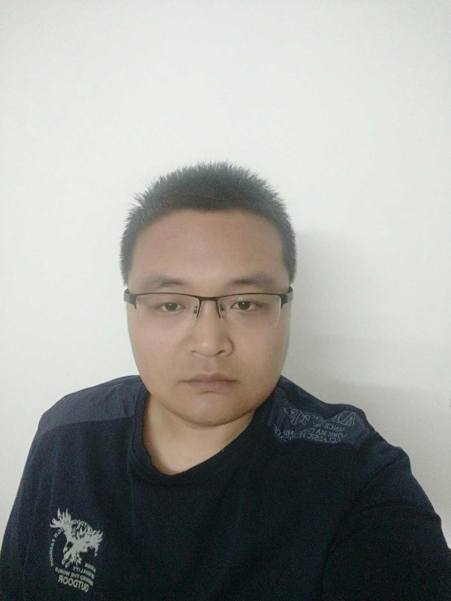

# 个人简历

**李仕杰**，男，博士，讲师，毕业于中国科学院上海天文台天体物理专业。
参与1项国家自然科学基金重点项目，参与3项国家自然科学青年基金。
现承担《Android程序设计》，《计算机网络基础》等课程的教学任务。
研究方向：星震学，星系形成与演化，宇宙学数值模拟。

<!-- I am a senior student majoring in **Automation** at Fuzhou University and **Robotics** at Maynooth University (Ireland, Combined Degrees). Currently, I am working as a research assistant in the **IACTIP Lab** (Provincial Key), advised by [Prof. Zhezhuang Xu](https://www.researchgate.net/profile/Zhezhuang-Xu). Here is [[my CV](https://caihanlin.com/file/CV-HanlinCAI.pdf)]. -->

 

## 发表论文：

<!-- **[Highlight] I am looking for PhD to start in 2025 Fall. Contact me if you have any leads!** -->

<!-- - **Sep 2020 - June 2024:** Fuzhou University (BEng) -->
<!-- - **Sep 2020 - May 2024:** Maynooth University (BSc) -->
<!-- - **June 2022 - Nov 2022:** Cambridge University (Visiting) -->
<!-- - Expect to apply for a one-year MSc in the UK and will graduate in 2025. Looking for PhD position after MSc! -->
1. Shijie Li, Youcai Zhang, Xiaohu Yang, Huiyuan Wang, Dylan Tweed, Chengze Liu, Lei Yang, Feng Shi, Yi Lu, Wentao Luo, Jianwen Wei.
“An Empirical Model to Form and Evolve Galaxies in Dark Matter Halos”.
Research in Astronomy and Astrophysics(SCI), 2016, 16(8)
2. 李仕杰，杨小虎
MCMC方法在星系形成半解析模型中的应用
天文学进展，2016，16（3）
3. Huiyuan Wang, H.J. Mo, Xiaohu Yang, Youcai Zhang, JingJing Shi, Y. P. Jing, Chengze Liu, Shijie Li, Xi Kang, Yang Gao.
“ELUCID - Exploring the Local Universe with reConstructed Initial Density field III: Constrained Simulation in the SDSS Volume ”
2016, The Astrophysical Journal(SCI), 831(2), 164
4. Yi Lu, Xiaohu Yang, Feng Shi, H.J. Mo, Dylan Tweed, Huiyuan Wang, Youcai Zhang, Shijie Li, S.H. Lim.
“Galaxy groups in the 2MASS Redshift Survey”. 
2016, The Astrophysical Journal(SCI), 832(1), 39
5. Xiaohu Yang, Youcai Zhang, Huiyuan Wang, Chengze Liu, Tianhuan Lu, Shijie Li, et al.
“ELUCID. V. Lighting Dark Matter Halos with Galaxies”.
2018, The Astrophysical Journal(SCI), 860(1), 30
6. Xiaohu Yang, Houjun Mo, Frank C. van den Bosch, Ana Bonaca, Shijie Li, Yi Lu, Yu Lu, Zhankui Lu.
“Constraining the Star Formation Histories in Dark Matter Halos. I. Central Galaxies”. 
2013, The Astrophysical Journal (SCI), 770, 115

 

---

## Research Interests

- Industrial IoT System
- Bluetooth Low Energy
- Applied Machine Learning

My current research focuses on practical problems that artificial intelligence faces in real life. My interests are on the **Machine Learning** and its applications in **Industrial IoT**. In a word, advanced technologies like ML and IoT positively influence the life of everybody.  I wish to devote my talent to this meaningful cause and bring well-being to society.

 

---

## News and Updates

- **Sep 2023：**Our works [DefenderIoT](https://fzuiot.site/) has been officially publicized by [Youth of FZU](https://mp.weixin.qq.com/s/MF2NJQtEHsVwsm8Ym-l7Gg).
- **Aug 2023：**Happy to be awarded the FEPG Scholarship.
- **May 2023：**Happy to be awarded the XiamenAir Scholarship.
- **May 2023：**Collected the Finalist Award in MCM 2023.
- **Jan 2023：**One paper accepted to ICAROB 2023, see you in Japan!
- **Jun 2022：**Visiting Research Intern at Cambridge University, advised by [Prof. Pietro Liò](https://www.cl.cam.ac.uk/~pl219/ ).
- If you are interested in my works, please feel free to book an [[online talk with me](https://calendly.com/lancecai/meet-with-lance)].
